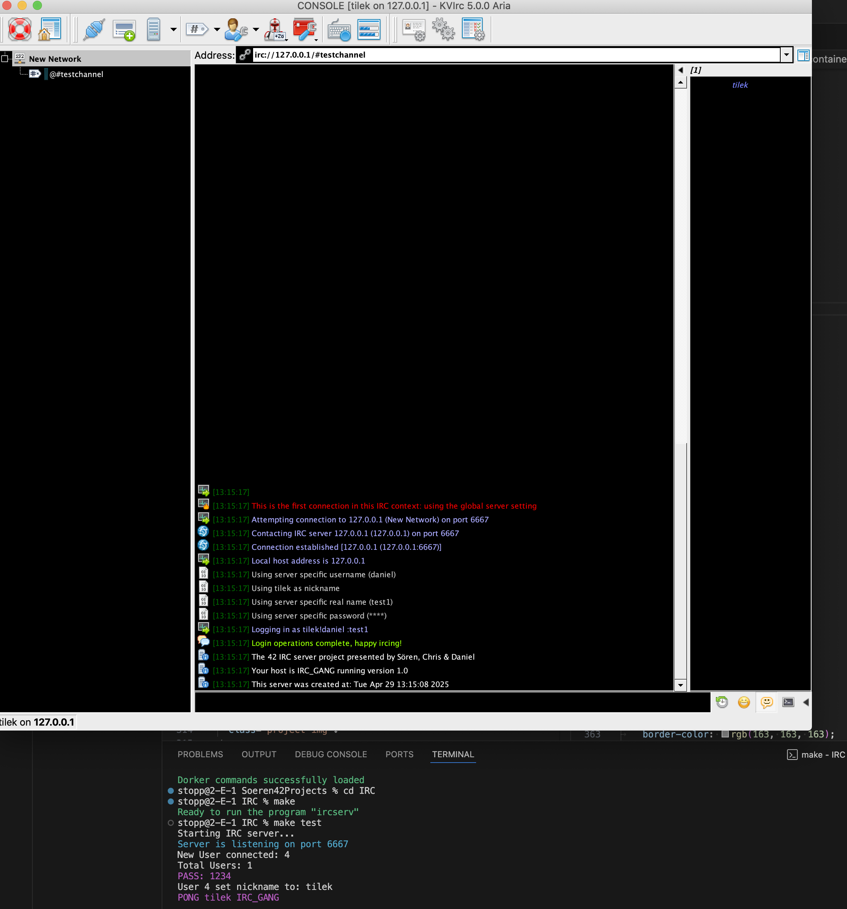

# ft_irc

Welcome to the ft_irc project repository! This project is part of the 42 curriculum and focuses on implementing a basic IRC (Internet Relay Chat) server using C++. The server facilitates real-time communication between multiple clients over TCP, handling various IRC commands and managing user sessions.

## Features

- **Multi-client support**: Handles multiple client connections simultaneously.
- **IRC protocol implementation**: Supports standard IRC commands and message formats.
- **Channel management**: Allows users to create, join, and manage chat channels.
- **User authentication**: Implements basic user authentication mechanisms.
- **Robust error handling**: Ensures stability and reliability during client interactions.

## Technologies Used

- **C++**: Core programming language for server implementation.
- **Sockets**: Utilized for network communication between server and clients.
- **Threads**: Manages concurrent client connections efficiently.

Here is an Overview of the subject:

[View the Subject](./IRC_subject.pdf)
